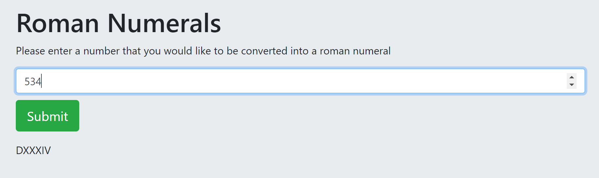

# _Roman Numerals_

#### _Converts arabic digits to roman numerals, January 29, 2008_

#### By _**Mike B Lambert**_

## Description

_Enter a number between 1 and 3,999, hit submit, and see the roman numeral equivalent of that number._

## Setup/Installation Requirements

* _Run in your browser_

## Support and contact details

_Please feel free to reach out to me at mlamb128@gmail.com_

## Technologies Used

_HTML, CSS, Javascript, and jQuery_

### License

*MIT License*

Copyright (c) 2018 **_Mike B Lambert_**
